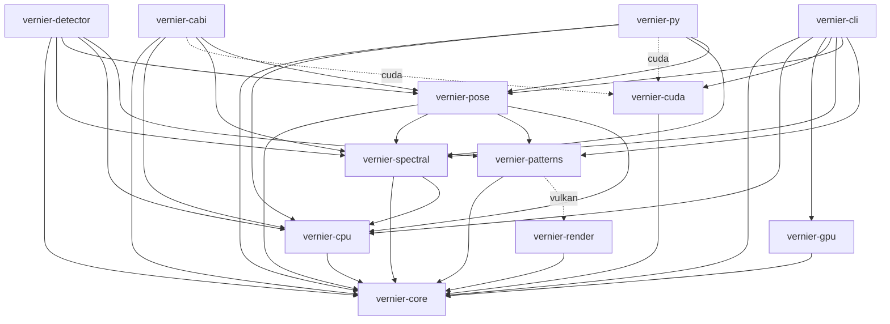

# Architecture

Crate dependency graph for the `vernier-rs` workspace. Edges are derived from
the `[dependencies]` sections of each crate's `Cargo.toml`. An edge **X → Y**
means *X depends on Y*.

## Mermaid



## ASCII (arrows point downward = "depends on")

```
  ┌────────────┐   ┌────────────┐   ┌────────────┐        ┌──────────────────┐
  │ vernier-cli│   │vernier-cabi│   │ vernier-py │        │ vernier-detector │   ← leaf crates
  └─────┬──────┘   └─────┬──────┘   └─────┬──────┘        └────────┬─────────┘   (nothing depends
        │                │                │                        │              on these)
        │   ┌────────────┴────────────────┴────────────────────────┤
        │   │                                                       │
        ▼   ▼                                                       ▼
   ┌──────────────────────────────────────────────┐        ┌───────────────┐
   │                 vernier-pose                  │◄───────┤ (detector too)│
   └───────────────────────┬──────────────────────┘        └───────────────┘
                           │
                           ▼
                 ┌──────────────────┐
                 │ vernier-spectral │◄──── cli, cabi, py, pose, detector
                 └─────────┬────────┘
                           ▼
                 ┌──────────────────┐
                 │ vernier-patterns │◄──── pose, detector, cli
                 └─────────┬────────┘
                           │ (vulkan feature, optional)
                           ▼
   ┌───────────┐   ┌───────────┐   ┌────────────┐   ┌────────────────┐
   │vernier-cpu│   │vernier-gpu│   │vernier-cuda│   │ vernier-render │
   └─────┬─────┘   └─────┬─────┘   └─────┬──────┘   └───────┬────────┘
         └───────────────┴───────────────┴──────────────────┘
                           ▼
                   ┌───────────────┐
                   │  vernier-core │   ← foundation (no internal deps)
                   └───────────────┘
```

## Exact edges

| Crate | Depends on |
|---|---|
| `vernier-core` | — |
| `vernier-cpu` / `vernier-gpu` / `vernier-cuda` | core |
| `vernier-render` | core |
| `vernier-patterns` | core, render *(optional, `vulkan` feature)* |
| `vernier-spectral` | core, cpu |
| `vernier-pose` | core, spectral, patterns, cpu |
| `vernier-detector` | core, spectral, pose, cpu, patterns |
| `vernier-cabi` | core, cpu, cuda *(optional, `cuda` feature)*, spectral, pose |
| `vernier-py` | core, cpu, cuda *(optional, `cuda` feature)*, spectral, pose |
| `vernier-cli` | core, cpu, spectral, pose, patterns, gpu, cuda |

## Notes

- `vernier-core` is the universal base (shared types: `Pose`, `ComputeBackend`,
  `BufferLayout`, …). `vernier-cpu` is the next-most-depended-on — the default
  backend, pulled in by spectral, pose, detector, cabi, py, and cli.
- `vernier-spectral` is the low-level spectral engine (FFT → bandpass → phase →
  unwrap → plane fit). It was renamed from `vernier-detection` to avoid
  confusion with `vernier-detector`.
- `vernier-detector` is the object/factory parity layer mirroring the C++
  `PatternDetector` / `Detector` classes; it wraps the functional engine
  (`vernier-spectral` / `vernier-pose`) in a class-shaped API.
- `patterns → render` is optional (the `vulkan` feature). The reverse edge
  `render → patterns` exists only as a **dev-dependency** for `render`'s
  example, so there is no runtime cycle.
- `vernier-dotnet` and `vernier-matlab` are **not** in this graph: they are
  binding shims that consume the `vernier-cabi` C library at the ABI level
  (P/Invoke / `calllib`), not Cargo dependencies.
